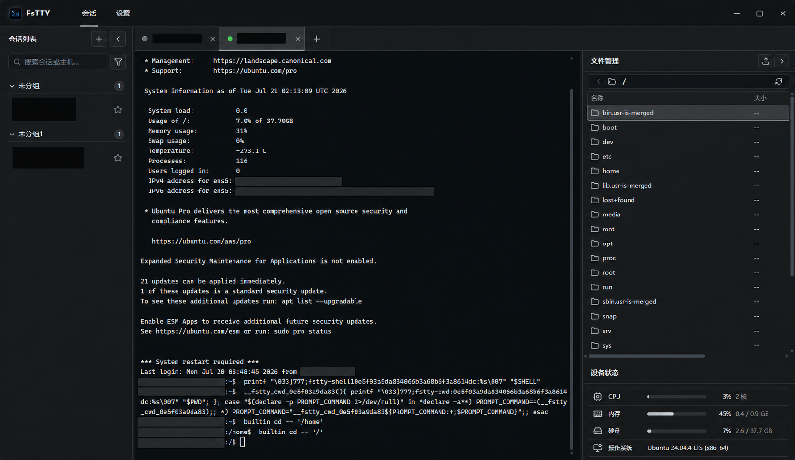

# FsTTY

为 Windows 打造的轻量 SSH 终端与远程文件管理工具。

**简体中文** | [English](README.en-US.md)

[](https://github.com/359956085/FsTTY/releases/latest)

[](LICENSE)



## 产品简介

FsTTY 将 SSH 终端、会话管理、SFTP 文件操作和设备状态集中在一个桌面工作区中。它适合需要频繁连接 Linux 服务器、维护多组主机或在终端与远程文件之间快速切换的 Windows 用户。

## 主要功能

| 功能 | 说明 |
| --- | --- |
| 会话管理 | 会话分组、拖动排序、跨组移动、搜索、收藏和多标签页工作区 |
| SSH 认证 | 支持密码、私钥文件和粘贴私钥正文 |
| 安全校验 | 首次连接确认主机密钥指纹，密钥变化时阻止连接 |
| 远程终端 | 基于 xterm.js 的交互式终端，支持复制、粘贴、清屏、重连和 tmux OSC 52 剪贴板 |
| 文件管理 | SFTP 浏览、上传、下载、远程拖放移动、新建文件夹、重命名和递归删除 |
| 设备状态 | 展示 CPU、内存近 10 分钟趋势、磁盘、网络上下行、操作系统和运行时间 |
| 应用设置 | 中文/English、远程剪贴板控制、手动检查更新、启动时检查更新和更新代理 |

## 下载与安装

前往 [GitHub Releases](https://github.com/359956085/FsTTY/releases/latest) 下载最新 Windows x64 安装包：

- 普通用户推荐下载 `*-setup.exe`（NSIS）。
- 企业部署或需要 MSI 的场景可下载 `*.msi`。

NSIS 安装包支持简体中文和英文，并自动跟随 Windows 显示语言；其他系统语言默认使用简体中文。为保持现有企业部署和升级兼容，MSI 安装包继续使用英文界面。

运行安装包并按提示完成安装。当前发布包未配置 Windows Authenticode 代码签名，Windows SmartScreen 可能显示安全提示；请确认安装包来自本仓库的 Releases 页面。

## 使用说明

### 1. 创建会话

1. 打开“会话”页，点击左侧会话列表顶部的 `+`。
2. 输入服务器主机、端口和账号。名称留空时会自动使用主机地址，分组可选。
3. 选择认证方式：
   - **密码**：输入 SSH 密码。
   - **私钥文件**：选择本机私钥文件，并在需要时输入口令。
   - **粘贴私钥**：粘贴 PEM 或 OpenSSH 私钥正文。
4. 保持“保存密码/私钥口令”勾选可将凭据保存到系统凭据库；取消勾选后，连接时会询问凭据并仅用于本次连接。
5. 保存会话。

私钥认证必须填写账号。文件私钥继续引用原文件路径，移动或删除文件后需要重新选择。

### 2. 建立连接

1. 打开会话标签，点击“连接”。
2. 首次连接会显示服务器主机密钥算法和 SHA-256 指纹。请通过可信渠道核对后再选择“信任并连接”。
3. 如果服务器主机密钥发生变化，FsTTY 会阻止连接。确认服务器确实更换密钥后，可在编辑会话中忘记旧记录并重新核对。
4. 凭据未保存时，根据弹窗输入密码或私钥口令；可选择保存或仅本次使用。

### 3. 使用终端

- 在中央终端区域输入命令。
- 右键菜单支持复制、粘贴、全选、清屏和重连；有选区时按 `Ctrl+C` 或 `Ctrl+Shift+C` 可复制到 Windows 剪贴板，按 `Ctrl+V` 可粘贴。无选区时 `Ctrl+C` 仍用于中断远程命令。
- 可同时打开多个会话标签，并拖动左右分隔线调整工作区宽度。

#### tmux 剪贴板

- tmux 开启鼠标模式后，普通拖动和右键由 tmux 处理；按住右键移动到菜单项并松开即可执行。按住 `Shift` 拖动可在 FsTTY 中直接选中文本，按住 `Shift` 右键可打开 FsTTY 菜单。
- tmux 复制模式通过 OSC 52 写入 Windows 剪贴板。运行 `tmux show -s set-clipboard`，结果应为 `external` 或 `on`。
- 运行 `tmux info | grep Ms` 检查剪贴板能力；如果显示 `[missing]`，请按 [tmux 官方说明](https://github.com/tmux/tmux/wiki/Clipboard) 配置 `terminal-features` 并重启 tmux 服务。

### 4. 管理远程文件

连接成功且服务器支持 SFTP 后，右侧“文件管理”面板会显示远程目录。

- 点击上传按钮选择单个本地文件。
- 将多个普通文件拖入文件列表，可依次上传到当前目录；暂不递归上传文件夹。
- 将远程文件或文件夹拖到目录行或路径面包屑，可移动到对应目录；同名目标不会被覆盖。
- 右键文件可下载、重命名、删除或复制路径。
- 右键文件夹可打开、重命名、递归删除或复制路径。
- 在列表空白区域右键，可新建文件夹、上传或刷新。

递归删除没有回收站和撤销功能，请确认目标路径后再操作。

### 5. 查看设备状态

右侧“设备状态”区域会在远端命令可用时展示操作系统、架构、运行时间、磁盘使用情况、网络上下行速度，以及 CPU、内存近 10 分钟趋势。受限账号或精简系统可能无法提供完整信息。

### 6. 设置与更新

在“设置”页可以：

- 切换中文或 English，设置会立即生效并保存。
- 手动检查更新。
- 开启启动时自动检查更新；发现新版本后仍需确认，不会静默安装。
- 配置空值、`http://`、`https://` 或 `socks5://` 更新代理。
- 开启或关闭远程程序通过 OSC 52 写入 Windows 剪贴板。

## MCP 自动化

FsTTY 可作为 MCP 服务，供 Agent 执行日常部署和生产排障。功能默认关闭，需在“设置 → MCP”中启用服务并授权会话分组。

- stdio 仅供本机使用：`fstty.exe --mcp-stdio`
- Streamable HTTP 用于局域网或 VPN：`http://<FSTTY_HOST_IP>:37653/mcp`
- 开启 HTTP 后监听所有 IPv4 网络接口（`0.0.0.0`），并使用保存在 Windows 凭据库中的 Bearer Token。
- HTTP 使用明文传输，仅应在可信局域网或 VPN 中使用，禁止暴露公网。
- `/mcp` 面向 Codex、IDE 等原生 MCP 客户端，并拒绝带 `Origin` 的请求；不支持浏览器 MCP 客户端或 CORS。
- 分组内状态读取和文件读取默认开启；命令、编辑、删除默认关闭。
- 命令权限可绕过文件编辑和删除限制，仅应授权给可信 Agent。
- 未知或变化的主机密钥必须先在 FsTTY 界面确认。
- stdio 的 `upload_local_file`、`download_remote_file` 仅访问 MCP 客户端声明的 Roots，适合同机传输。
- HTTP 使用 `create_remote_file_download_link`、`create_remote_file_upload_link` 签发 5 分钟有效的传输链接，不依赖客户端 Roots。
- 链接工具同时返回标准 MCP `resource_link`、文本 URL 和结构化数据；是否自动保存由 MCP 客户端决定。
- 下载链接支持单区间断点续传；上传链接可直接打开同源文件选择页，也可向文件名路径发送原始 `PUT`。
- 传输链接本身即凭据，不再要求 Bearer Token。下载可在有效期内顺序重试；上传首次成功后立即失效，且绝不覆盖已有远程文件。
- MCP 审计只记录工具、会话、结果和耗时等元数据，不记录命令、文件内容或秘密。

## 安全说明

- 选择保存后，密码、粘贴私钥正文和私钥口令存入 Windows 系统凭据库，不写入普通会话配置。
- 会话配置只保存连接信息和文件私钥路径，不返回或显示已保存的私钥正文。
- 第一次连接必须确认主机密钥；已信任密钥发生变化时，连接会被阻止。
- “仅本次连接”凭据只在当前连接流程中使用。
- OSC 52 开启后，远程程序可以替换 Windows 剪贴板内容；不需要 tmux 剪贴板同步时可在设置页关闭。

## 当前限制

- 当前仅发布 Windows x64 安装包。
- 不支持 SSH Agent、Pageant、硬件安全密钥或 SSH 证书认证。
- 不提供密钥生成、自动上传公钥或远程多选文件操作。
- 拖放上传支持多个普通文件，不递归上传本地文件夹。

## 本地开发

### 环境要求

- Windows
- Node.js 20+
- Rust stable
- [Tauri 2 系统依赖](https://v2.tauri.app/start/prerequisites/)

### 常用命令

```bash
npm ci
npm run tauri dev
```

```bash
npm run typecheck
npm run build
cargo test --locked --manifest-path src-tauri/Cargo.toml
cargo check --locked --manifest-path src-tauri/Cargo.toml
```

## 社区鸣谢

感谢 [LINUX DO 社区](https://linux.do/) 对开源交流与项目成长的支持。

## 许可证

FsTTY 使用 [MIT License](LICENSE) 开源。
