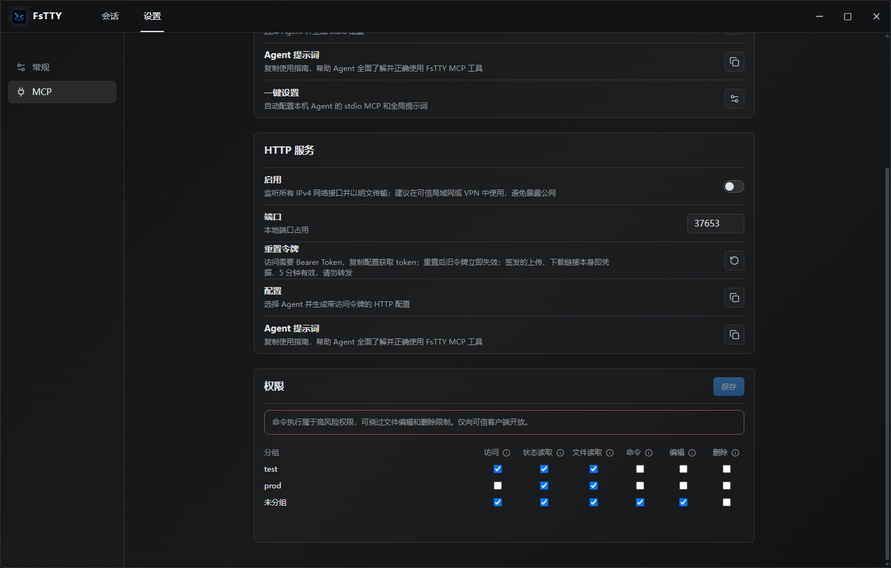

# FsTTY

面向 AI Agent 的 Windows SSH 与 MCP 安全操作台。

**简体中文** | [English](README.en-US.md)

[](https://github.com/359956085/FsTTY/releases/latest)


[](LICENSE)



## 为什么使用 FsTTY MCP

FsTTY 把已经保存的 SSH 会话安全地开放给 Codex、Claude、Cursor 等 Agent。Agent 不接触密码和私钥，只能在用户授权的会话分组中调用明确的工具。

- **最小权限**：按会话分组分别控制访问、状态读取、文件读取、命令、编辑和删除。
- **复用 SSH 能力**：终端、SFTP、主机密钥校验和系统凭据库由 FsTTY 统一处理。
- **本地与远程接入**：支持本机 stdio，以及可信局域网或 VPN 内的 Streamable HTTP。
- **一键配置 Agent**：自动检测本机 Agent，合并 MCP 配置和全局提示词，不覆盖无关设置。
- **适合生产排障**：支持远程日志搜索、分段读取、命令执行、原子写入和受控文件传输。
- **可审计**：独立记录工具、会话、结果和耗时；可选记录脱敏后的工具输入。

## MCP 工具

FsTTY 目前提供 16 个 MCP 工具：

| 权限 | 工具 | 能力 |
| --- | --- | --- |
| 无需会话权限 | `get_permission_guide` | 返回目标工具所需权限和当前界面的设置步骤 |
| 状态读取 | `list_sessions`、`get_device_status` | 发现已授权会话；读取 CPU、内存、磁盘、网络、系统和运行时间 |
| 文件读取 | `list_remote_files`、`read_remote_file`、`search_remote_file` | 浏览目录、分段读取文件、按关键词扫描远程日志 |
| 命令 | `execute_command` | 在已授权会话中执行远程 Shell 命令 |
| 编辑 | `write_remote_file`、`create_remote_directory`、`rename_remote_entry`、`move_remote_entry` | 原子写入文件；创建、重命名和移动远程条目 |
| 删除 | `delete_remote_entry` | 递归删除远程文件或目录 |
| stdio 传输 | `upload_local_file`、`download_remote_file` | 在 MCP 客户端声明的 Roots 与远程服务器之间传输文件 |
| HTTP 传输 | `create_remote_file_upload_link`、`create_remote_file_download_link` | 签发 5 分钟有效的上传或下载链接 |

`search_remote_file` 单次最多扫描 `16 MiB`，响应限制为 `8 MiB`，可携带前后各 `0–50` 行上下文，并通过 `nextOffset` 继续扫描。适合搜索大日志，无需先读取完整文件。

## 权限与安全边界

新会话分组默认未向 MCP 开放。启用分组访问后，状态读取和文件读取默认开启，命令、编辑和删除默认关闭。

- 权限保存后对下一次 stdio 或 HTTP 请求立即生效，无需重连。
- 命令权限可能绕过编辑和删除限制，只应授予可信 Agent。
- Agent 无法读取密码、私钥正文、私钥口令或 HTTP Bearer Token。
- 首次出现或发生变化的主机密钥必须先在 FsTTY 界面核对并确认。
- 文件写入采用临时文件和原子替换；上传、重命名和移动不会覆盖已有目标。
- 删除没有回收站，FsTTY 会在工具描述中将其标记为破坏性操作。
- 权限配置无法读取或校验失败时，请求默认拒绝。

## stdio 与 HTTP

| | stdio | Streamable HTTP |
| --- | --- | --- |
| 场景 | 本机 Agent | 可信局域网或 VPN 内的 Agent |
| 地址 | `fstty.exe --mcp-stdio` | `http://<FSTTY_HOST_IP>:37653/mcp`（默认端口） |
| 认证 | 本地进程通信 | Windows 凭据库中的 Bearer Token |
| 本地文件传输 | 使用 MCP 客户端 Roots | 使用 5 分钟传输链接 |
| 网络暴露 | 无监听端口 | 监听所有 IPv4 接口，明文传输 |

HTTP 禁止暴露到公网。`/mcp` 面向原生 MCP 客户端，拒绝带 `Origin` 的请求，不支持浏览器 MCP 客户端或 CORS。

传输链接本身即凭据，不再要求 Bearer Token。下载支持单区间断点续传；上传首次成功后立即失效，并且绝不覆盖已有远程文件。

## 快速开始

1. 从 [CNB Releases（国内）](https://cnb.cool/359956085/FsTTY/-/releases) 或 [GitHub Releases](https://github.com/359956085/FsTTY/releases/latest) 安装 FsTTY。
2. 创建 SSH 会话并完成首次主机密钥确认。
3. 打开“设置 → MCP”，启用 `stdio`。
4. 在“权限”中开启需要暴露的会话分组，并按需授权工具类别。
5. 点击“一键设置”，选择本机 Agent 并完成配置。
6. 让 Agent 先调用 `list_sessions`，再按返回的会话 ID 使用其他工具。

也可以分别复制 stdio 或 HTTP 配置，以及 Agent 使用提示词，手工粘贴到其他 MCP 客户端。

## 一键配置本地 Agent

| Agent | MCP 配置 | 全局提示词 |
| --- | --- | --- |
| Codex | 自动合并 | 自动合并 `AGENTS.md` |
| Claude | 使用官方 CLI 配置用户级 MCP | 自动合并 `CLAUDE.md` |
| Cursor | 自动合并 | 复制后手工粘贴到 User Rules |
| VS Code / GitHub Copilot | 自动合并默认用户 Profile | 写入独立 instructions 文件 |
| Gemini CLI | 自动合并 | 自动合并 `GEMINI.md` |
| OpenCode | 保留 JSONC 注释并自动合并 | 自动合并 `AGENTS.md` |
| Trae | 自动合并 | 复制后手工粘贴到 User Rules |
| Trae CN | 自动合并 | 复制后手工粘贴到 User Rules |

自动配置只修改 FsTTY 自有节点或 `fstty:begin/end` 标记区块。配置损坏、OpenCode 双配置冲突或单个 Agent 配置失败时，该 Agent 保持原文件不变，其他 Agent 继续处理。重复运行会更新配置，不会重复追加内容。

## MCP 审计日志

审计日志独立保存在 `%APPDATA%\FsTTY\logs\mcp-audit-YYYY-MM-DD.log`，最多保留 15 天。

- 基础记录包含传输方式、工具、会话、结果和耗时。
- “设置 → 常规 → 日志 → 记录 MCP 工具输入”默认关闭，可实时开启。
- 开启后记录命令、路径等工具参数，但不记录工具输出、请求头、Token 或传输正文。
- `write_remote_file.content` 仅记录 UTF-8 字节数和 SHA-256；正文不会写入日志。
- 每条记录使用单行常规日志格式，字符串和控制字符会安全转义。

## Windows SSH 工作区

MCP 之外，FsTTY 也是完整的 Windows SSH 客户端。


| 功能 | 说明 |
| --- | --- |
| 会话管理 | 分组、拖动排序、跨组移动、搜索、收藏和多标签页 |
| SSH 认证 | 密码、私钥文件和粘贴私钥正文；敏感凭据保存到系统凭据库 |
| 远程终端 | xterm.js 6、复制粘贴、清屏、重连、tmux 鼠标和 OSC 52 剪贴板 |
| 历史命令 | 所有会话共享、搜索、向上加载、去重、JSON 导入导出和清空；支持 Bash、Zsh 自动采集 |
| 文件管理 | SFTP 浏览、上传、下载、拖放移动、新建目录、重命名、复制路径和递归删除 |
| 设备状态 | CPU、内存趋势、磁盘、网络上下行、操作系统和运行时间 |
| 自动更新 | CNB/GitHub 并发检查、版本忽略、Markdown 更新说明和更新代理 |

历史命令的 Enter 或鼠标单击只会把命令放入终端，不会自动执行。历史窗口支持搜索、键盘选择和拖动调整宽高。

## 下载与安装

优先前往 [CNB Releases（国内）](https://cnb.cool/359956085/FsTTY/-/releases)，也可使用 [GitHub Releases](https://github.com/359956085/FsTTY/releases/latest) 下载 Windows x64 安装包：

- 普通用户推荐 `*-setup.exe`（NSIS）。
- 企业部署或 MSI 场景使用 `*.msi`。

NSIS 支持简体中文和英文，并跟随 Windows 显示语言。发布包暂未配置 Windows Authenticode 签名；若 SmartScreen 显示提示，请确认安装包来自本仓库 Releases 页面。

## 当前限制

- 当前仅发布 Windows x64 安装包。
- HTTP MCP 使用明文传输，只能用于可信局域网或 VPN。
- 不支持 SSH Agent、Pageant、硬件安全密钥或 SSH 证书认证。
- 本地文件夹暂不支持递归拖放上传。
- Trae、Trae CN 和 Cursor 的 User Rules 需要手工粘贴。

## 本地开发

环境要求：Windows、Node.js 20+、Rust stable 和 [Tauri 2 系统依赖](https://v2.tauri.app/start/prerequisites/)。

```bash
npm ci
npm run tauri dev
```

```bash
npm run verify:all
```

## 社区鸣谢

感谢 [LINUX DO 社区](https://linux.do/) 对开源交流与项目成长的支持。

## 许可证

FsTTY 使用 [MIT License](LICENSE) 开源。
